# Android Message Passing Stack

This diagram shows how Android control messages move through the system. The
main boundary is between transport framing and product behavior: BLE, stdio, and
test fixtures all produce complete `ProtocolMessage` values before handing work
to `RequestRouter`.

```mermaid
flowchart LR
    subgraph Android["Android app"]
        UI["Compose UI and view models"]
        Repo["Player repository"]
        AndroidTransport["MatchboxTransport"]
        AndroidCodec["ProtocolMessage JSON codec"]
        AndroidChunks["BLE chunk encoder and reassembler"]
        AndroidGatt["Android BluetoothGatt client"]

        UI --> Repo
        Repo --> AndroidTransport
        AndroidTransport --> AndroidCodec
        AndroidCodec --> AndroidChunks
        AndroidChunks --> AndroidGatt
    end

    subgraph Radio["BLE radio link"]
        RxTx["RX writes and TX notifications"]
    end

    subgraph DeviceBle["Device BLE transport"]
        BlueZ["BlueZ GATT service"]
        GattTransport["mba-bt GATT transport"]
        DeviceChunks["ChunkReassembler and encode_chunks"]
    end

    subgraph MbaBt["mba-bt"]
        Router["RequestRouter"]
        SessionGate["SessionGate"]
        PlayerBackend["PlayerBackend trait"]
        FakePlayer["FakePlayerBackend"]
        HttpPlayer["mba-player HTTP backend"]
    end

    subgraph Player["mba-player"]
        PlayerApi["HTTP API"]
        PlayerState["Playback, library, queue state"]
        Mpd["MPD"]
    end

    AndroidGatt <--> RxTx
    RxTx <--> BlueZ
    BlueZ --> GattTransport
    GattTransport --> DeviceChunks
    DeviceChunks --> Router
    Router --> SessionGate
    Router --> PlayerBackend
    PlayerBackend --> FakePlayer
    PlayerBackend --> HttpPlayer
    HttpPlayer --> PlayerApi
    PlayerApi --> PlayerState
    PlayerState --> Mpd

    subgraph LocalDev["Local development and tests"]
        Fixtures["protocol/fixtures/v1 JSON"]
        FrameTools["stdio tools with uint32_le length frames"]
        FrameDecoder["FrameDecoder"]
        InMemoryBle["InMemoryBleTransport"]

        Fixtures --> Router
        FrameTools --> FrameDecoder
        FrameDecoder --> Router
        InMemoryBle --> DeviceChunks
    end
```

## Layer Responsibilities

- `ProtocolMessage` is the app-level request, response, or event envelope.
- BLE chunks are transport-only. Their `message_id` groups physical chunks and
  is discarded after reassembly.
- The JSON request `id` is app-level. It correlates a response with a request
  and survives across transports.
- `RequestRouter` handles complete protocol requests. It should not know whether
  a message came from BLE, stdio, fixtures, or a future transport.
- `SessionGate` enforces the v1 one-active-client rule.
- `PlayerBackend` lets router tests use `FakePlayerBackend` now and a real
  `mba-player` HTTP backend later.

## Current Phase Boundary

Phase 2 owns everything through `RequestRouter`, `SessionGate`, the fake player,
the framed stdio exerciser, and the in-memory BLE transport tests.

Phase 3 starts at the `BlueZ GATT service` and `mba-bt GATT transport` boxes.
The first slice is `mba-bt --ble-local`, which plugs real BlueZ GATT into the
already-tested router path while still using `FakePlayerBackend`.

Within the BLE GATT transport, `mba-bt` treats a TX notification subscription as
the app-session boundary. The subscribed phone has opened the response path, so
the GATT layer can attach that Bluetooth address to `SessionGate`, accept RX
writes only from that address, and release the session when notifications close.
